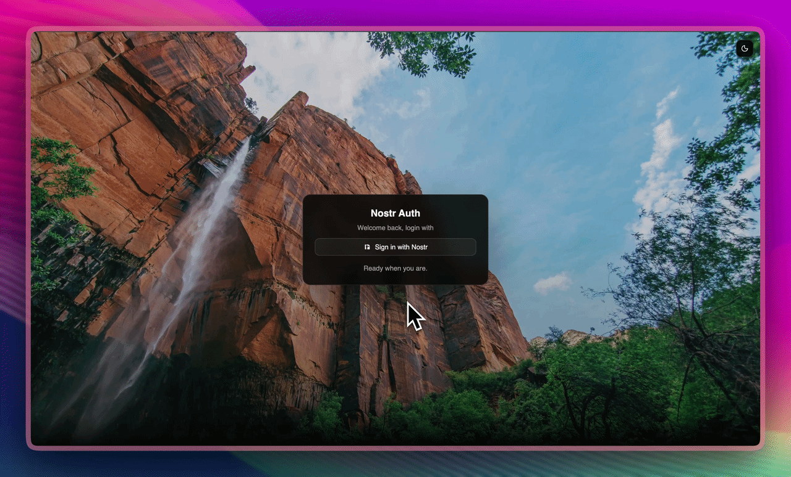

# Nostr Auth

Authentication with Nostr.

## Requirements

- [Taskfile](https://taskfile.dev/)
- Go 1.26+
- Overmind (`go install github.com/air-verse/air@latest`)
- Air (`go install github.com/air-verse/air@latest`)
- Golangci-lint (`go install github.com/golangci/golangci-lint/v2/cmd/golangci-lint@latest`)
- [bun](https://bun.sh/)
- Docker and Docker Compose (to try demo)

## Running locally

- Fork
- `bun install`
- `go install`
- `cp auth.json.example auth.json`
- Edit the `auth.json`
- `cp .env.example .env`
- Edit the `.env`
- `task dev`

Should be available on http://localhost:3000

## Testing demo

- `bun install`
- `go install`
- `task demo` Check out the examples [README.md](./examples/proxy/README.md)

## Supports

- Kubernetes Gateway API
- Kubernetes Ingress
- Nginx
- Traefik
- Envoy
- Caddy

## License

[MIT](./LICENSE)

## Credits

- Photo by <a href="https://unsplash.com/@wilstewart3">Wil Stewart</a> on <a href="https://unsplash.com/photos/landscape-photography-of-brown-mountain-pHANr-CpbYM">Unsplash</a>
